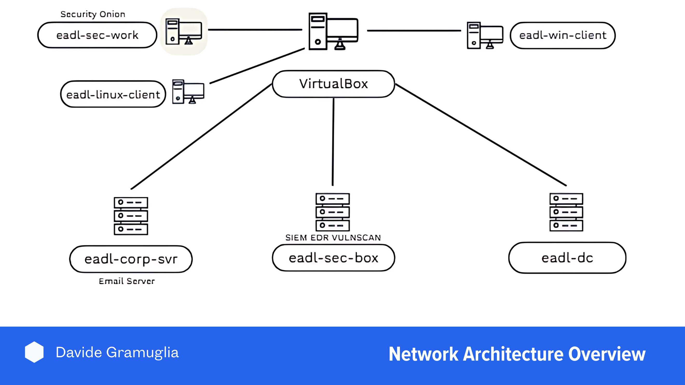

# Enterprise Attack Detection Lab (EADL)

  

    This project demonstrates enterprise‑style network design, Windows/Linux administration, and SOC workflows by building a small business network with Active Directory, a corporate server, Security Onion, and Wazuh for endpoint telemetry and detections. The goal is to document reproducible builds, clear evidence (screenshots, configs), and measurable outcomes recruiters can review quickly.
  

  

    Images: place PNG/JPG files in <code>docs/assets/images</code> and reference them with relative paths like <code>./assets/images/topology.png</code>. This works reliably on GitHub Pages. Do not start image paths with <code>/</code>.
  

## About this project

- Why: Demonstrate practical skills for SOC/Blue Team roles—AD setup, endpoint management, logging, and analysis in a realistic lab.  
- What: VirtualBox NAT lab with a domain controller, Windows and Linux clients, a MailHog server, a Wazuh manager, and a Security Onion workstation.  
- Evidence: Build steps, configuration tables, and screenshots showing domain joins, agent enrollment, dashboards, and test data flows.

### Topology

  

  Add a simple diagram (draw.io/diagrams.net or screenshots) that shows the NAT network, DC, clients, Wazuh, Security Onion, and the corporate server. Save as <code>docs/assets/images/topology.png</code>.

### Configuration summary

#### Hosts

| Hostname | IP Address | Function |
|---|---|---|
| eadl-dc | 10.0.0.5 | Domain Controller (AD DS, DNS, DHCP) |
| eadl-win-client | 10.0.0.100 | Windows Workstation (domain‑joined) |
| eadl-linux-client | 10.0.0.101 | Linux Desktop (AD‑joined via Winbind) |
| eadl-corp-svr | 10.0.0.8 | Corporate Server (MailHog) |
| sec-box | 10.0.0.10 | Wazuh Manager (SIEM) |
| eadl-sec-work | 10.0.0.103 | Security Onion desktop (NSM/analysis) |

#### VM specs

| VM Name | Operating System | Specs | Storage (min) |
|---|---|---|---|
| eadl-dc | Windows Server 2025 | 2 CPU / 4096 MB | 50 GB |
| eadl-win-client | Windows 11 Enterprise | 2 CPU / 4096 MB | 80 GB |
| eadl-linux-client | Ubuntu 22.04 Desktop | 1 CPU / 2048 MB | 80 GB |
| eadl-sec-work | Security Onion 2.4.x | 1 CPU / 2048 MB | 55 GB |
| sec-box | Ubuntu 22.04 Desktop | 2 CPU / 4096 MB | 80 GB |
| eadl-corp-svr | Ubuntu 22.04 Server | 1 CPU / 2048 MB | 25 GB |

#### Core network

| Setting | Value |
|---|---|
| VirtualBox NAT network name | eadl-network |
| Subnet / Gateway | 10.0.0.0/24, gw 10.0.0.1 |
| AD Domain | corp.eadl-dc.com |
| DC DNS forwarder | 8.8.8.8 |
| DHCP scope (lab) | 10.0.0.100–10.0.0.200 |

#### Accounts (public‑safe placeholders)

| Account | Password | Host |
|---|---|---|
| Domain Administrator | [REDACTED] | eadl-dc |
| Windows client user (domain) | [REDACTED] | eadl-win-client |
| Linux client user (domain) | [REDACTED] | eadl-linux-client |
| Corp server admin | [REDACTED] | eadl-corp-svr |
| Wazuh admin | [REDACTED] | sec-box |
| Security Onion workstation | [REDACTED] | eadl-sec-work |

### Evidence gallery

- Domain join (Windows):   
- Domain join (Linux):   
- Wazuh manager dashboard:   
- Security Onion desktop:   
- MailHog UI: 

  Add screenshots with filenames matching the references above into <code>docs/assets/images</code>. Use short, clear captions in the surrounding text.

---

## Sections

- [01 — Active Directory baseline](sections/01-ad-baseline.md)
- [02 — Windows workstation (AD join)](sections/02-windows-workstation.html)
- [03 — Linux workstation (AD join)](sections/03-linux-workstation.md)
- [04 — Corporate server & MailHog](sections/04-corporate-server-mailhog.md)
- [05 — Security Onion desktop](sections/05-security-onion-desktop.md)
- [06 — Security server (sec-box) prep](sections/06-security-server-sec-box.md)
- [07 — Wazuh manager install + disk expansion](sections/07-wazuh-manager-install.md)
- [08 — Enroll Wazuh agents (Win/Linux)](sections/08-wazuh-agents-enroll.md)
- [09 — Wazuh groups & agent.conf](sections/09-wazuh-groups-agentconf.md)
- [10 — Users, mapping & snapshots](sections/10-users-and-snapshots.md)
- [11 — Optional: Attacker & simulation](sections/11-attacker-simulation.md)

<!-- Footer nav (optional) -->

  <a href="./index.md" class="btn btn-blue" style="text-decoration:none;border:1px solid #e5e7eb;padding:8px 12px;border-radius:6px;background:#eff6ff;">← Back to index</a>
  <a href="./sections/01-ad-baseline.md" class="btn btn-green" style="text-decoration:none;border:1px solid #e5e7eb;padding:8px 12px;border-radius:6px;background:#ecfdf5;">Start: AD baseline →</a>

