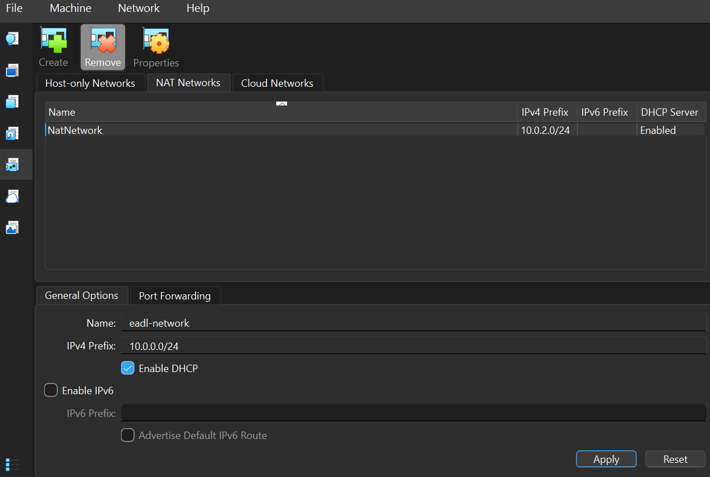
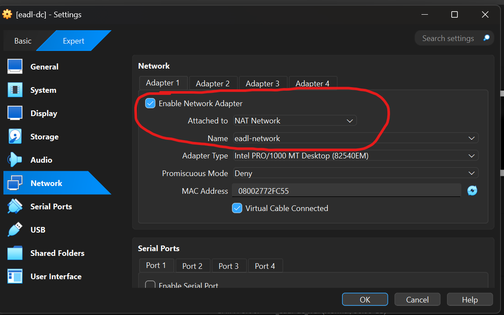
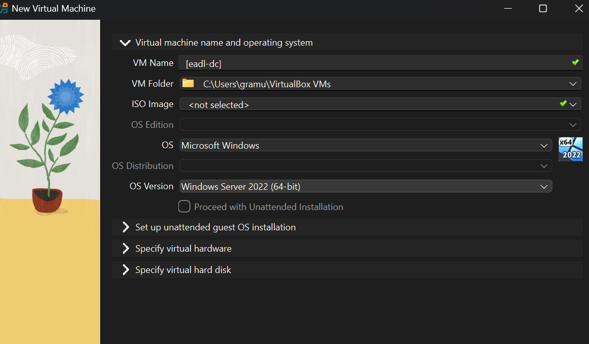
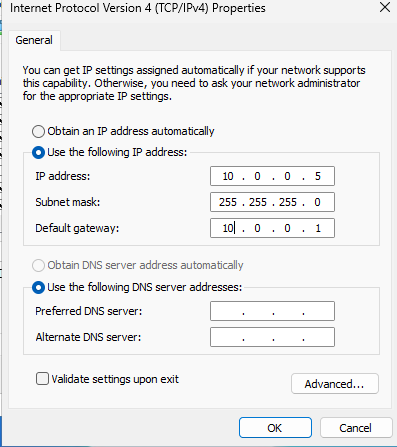
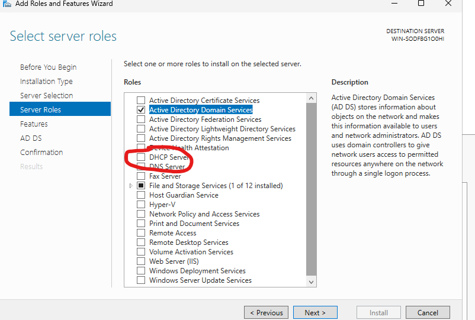
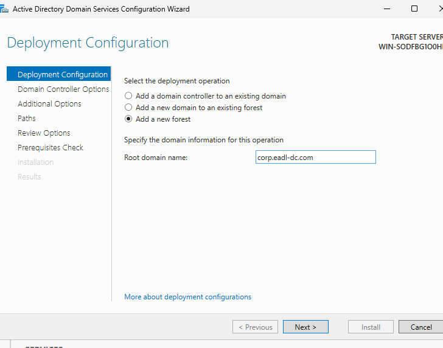
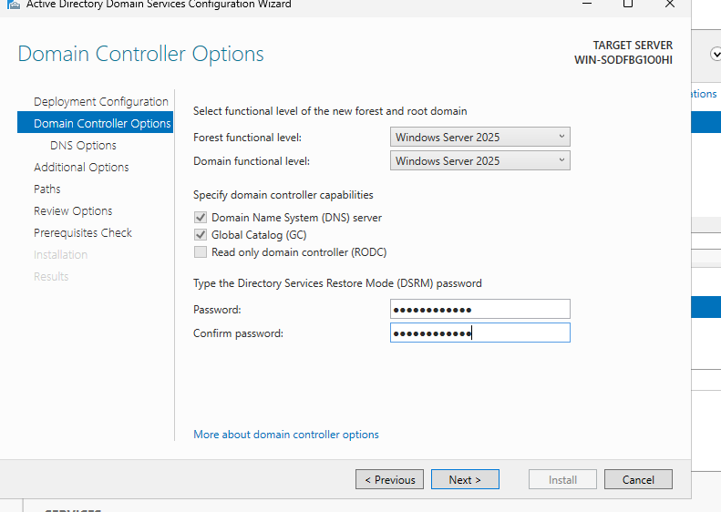
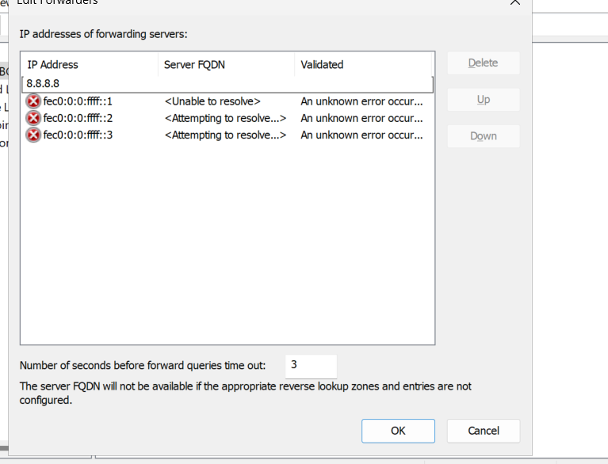

# Active Directory baseline

Goal: Stand up eadl-dc as the forest root domain controller for corp.eadl-dc.com on a VirtualBox NAT network, with DNS and optional DHCP, and take a baseline snapshot. [file:55]

MINE: The first part i will configure and deploy is the Domain Controller. It will provide centrilized authentification, authorization for every other host of the simulated enterprise network.
It will provide service as DNS and optional DHCP
In the following chapter i will deploy the VMs and configurations

## 1) VM and network

The first important part is creating the NAT Network as in photo

The first important part is configuring the NAT Network 

<b> In this case the NAT network will allow to create a virtual private LAN with its own virtual router thats similate a real LAN. </b>

Put the DC and all the hosts in a private

## 2) Install Windows Server 2025

Lets install the Windows Server 2025

4096 mb ram 2vcore

- i set set local Administrator password “CiaoCiao123!” during setup. The

<b> The password are easy to crack on purpose because later, i will eventually try to attack the servers. In a real enterprise, the password and the contrmisure will be way more complex. </b>

- Post‑install: disable screensaver (usability).

## 3) Static IP on DC

- Control Panel → Network and Internet → Network Connections → Ethernet → IPv4. Set:  
  - IP: 10.0.0.5  
  - Mask: 255.255.255.0  
  - Gateway: 10.0.0.1  
  - Preferred DNS: 10.0.0.5 (self)  
- Rationale: DC must be reachable at a fixed address, and clients need to resolve via the DC’s DNS. 

## 4) Add AD DS, DNS, DHCP roles

- Server Manager → Add Roles and Features → Role‑based → select “Active Directory Domain Services,” “DNS Server,” and “DHCP Server,” keep defaults, Install. [file:55]  

Add screenshot: ./assets/images/ad/04-add-roles.png showing AD DS/DNS/DHCP selected. [file:55]

MINE:

## 5) Promote to domain controller

- Server Manager → AD DS notification “Promote this server to a domain controller.”  
- Choose “Add a new forest,” Root domain name: corp.eadl-dc.com. [file:55]  
- Domain Controller Options: Forest and Domain functional level = Windows Server 2025, DNS server + GC checked; set DSRM password “CiaoCiao123!”; Next → Install (VM will reboot). [file:55]  

MINE:

 → Properties → Forwarders → Edit → add 8.8.8.8 → OK.

3) Quick test on eadl‑dc:

## 7) Optional: DHCP scope

- Tools → DHCP → IPv4 → New Scope: 10.0.0.100–10.0.0.200, mask /24; Router 10.0.0.1; DNS 10.0.0.5. [file:55]  
- Post‑Install configuration: authorize server in AD (use CORP\Administrator), Commit; state should show “Online.” [file:55]  

Add screenshots:  
- ./assets/images/ad/09-dhcp-scope.png (range/router/DNS) [file:55]  
- ./assets/images/ad/10-dhcp-authorized.png (server authorized) [file:55]

MINE:

## 8) Create initial identities

- Tools → Active Directory Users and Computers → Users → New → User. Create “Sam Wilson” and “Chris Lee” with temporary lab password “password123@” and uncheck “User must change password at next logon” for lab workflows. [file:55]  

Add screenshot: ./assets/images/ad/11-users-created.png (both users present). [file:55]

Security note: Weak passwords are intentional for simulation; never reuse outside the lab. [file:55]

MINE:

## 9) Baseline snapshot

- VirtualBox → Machine → Take Snapshot → “Baseline conf.” Reason: quick rollback before joining clients or installing services. [file:55]  

Add screenshot: ./assets/images/ad/12-snapshot-baseline.png (snapshot dialog). [file:55]

MINE:

## Verification checklist

- Server is a domain controller for corp.eadl-dc.com; AD DS and DNS installed, DNS forwarder 8.8.8.8 set. [file:55]  
- Static IP 10.0.0.5 configured; ping/nslookup succeed; DHCP scope authorized (if using DHCP). [file:55]  
- Initial users created; baseline snapshot taken successfully. [file:55]

MINE:
