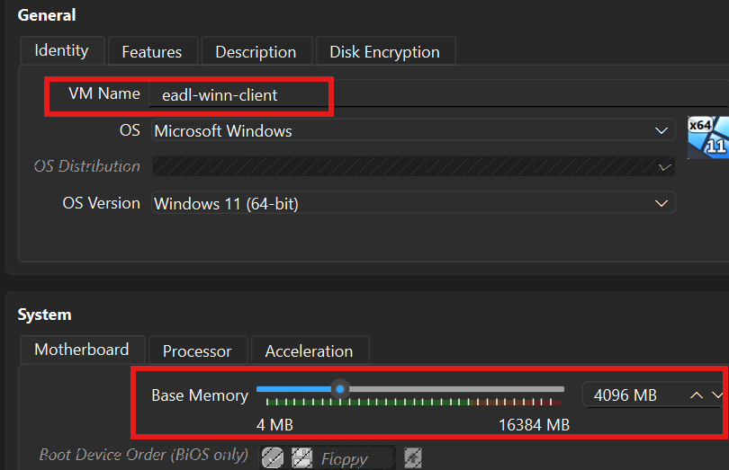
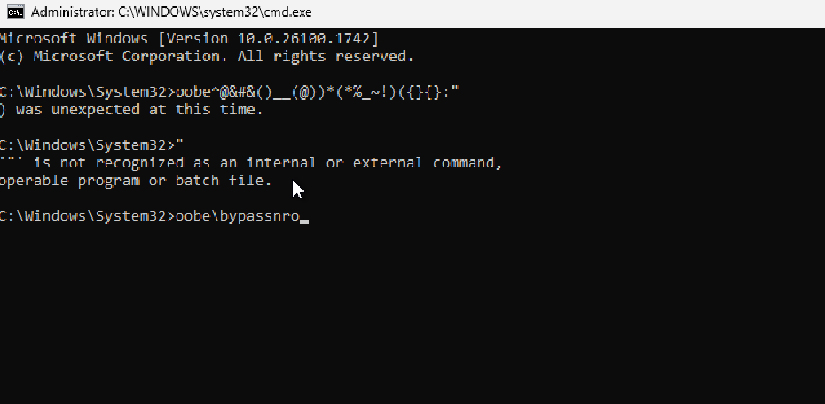
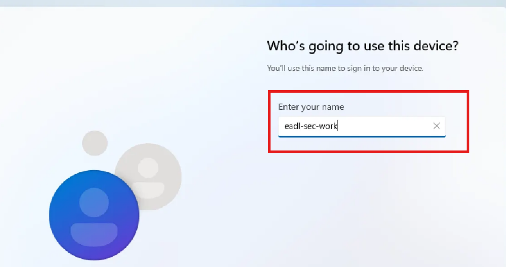
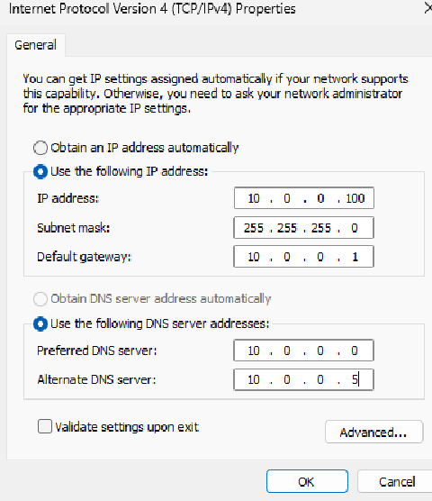
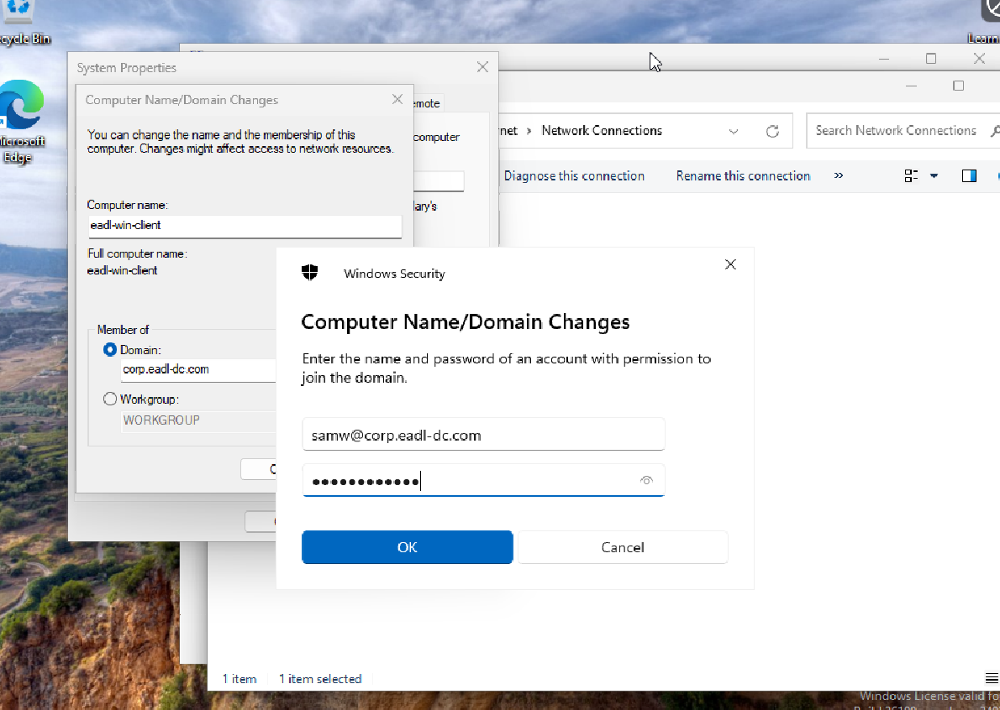

[← Back to index](../index.md){: .btn .btn-blue }
---
title: Windows workstation (AD join)
nav_order: 2
---

# Windows workstation (AD join)

**So now lets create a Workstations** that acts like as a realistic employee endpoint, joined the domain. Ready to be monitored, attacked

**Goal:** Build a Windows 11 Enterprise workstation named `eadl-win-client`, give it a static IP on the lab NAT network, point DNS to the domain controller, and join the domain `corp.eadl-dc.com`.

## Prerequisites

- Active Directory baseline completed on `eadl-dc (10.0.0.5)` with DNS and forwarder configured.  
- VirtualBox NAT Network `eadl-network (10.0.0.0/24, gateway 10.0.0.1)` available.  
- Windows 11 Enterprise ISO downloaded.

## 1) Create the VM

**Lets go to Virtual Box Creating a new VM with Windows 11, same specs as before.**  
- Name: `eadl-win-client`, `2 vCPU`, `4 GB RAM`, `80 GB disk`

  
<strong>Click to show screenshot</strong>

  

## 2) Install Windows 11 + Host-Only

**Mount the Windows 11 Enterprise ISO** and perform a standard installation with default partitions.

**Then after the installation is completed, because its a lab i im adding any email to sign up**  
to do so i configured just for now the network adpater in `Host Only Adapter` and then i run those command as shown in the image beloiw:  
press shift f10 to open the cmd

  
<strong>Click to show screenshot</strong>

  

**Then the VM will restart and lets choose the VM name**

  
<strong>Click to show screenshot</strong>

  

## 3) Configure network (static IP + DNS)

**Let's change again the  network adapter to Nat Networ, eadl network.** (Previously changed to Host-Name to bypass email sign in)

Set a static IPv4 address and DNS so AD lookups work reliably: `IP 10.0.0.100`, `Mask 255.255.255.0`, `Gateway 10.0.0.1`, `Preferred DNS 10.0.0.5`.

  
<strong>Click to show screenshot</strong>

  

## 4) Set hostname and reboot

**Then lets go to control panel and change the name of the workstation and domain path, so it refers to the domain controler**  
`Settings → System → About → Rename this PC → eadl-win-client`

  
<strong>Click to show screenshot</strong>

  

## 4) First domain logon and checks

**Sign in with a domain user created in the AD baseline to confirm Kerberos/SSO and profile creation**

  
<strong>Click to show screenshot</strong>

  

The Windows Worstation ended. Next section

[Next: Linux workstation →](./03-linux-client-ad-join.md){: .btn .btn-green }
