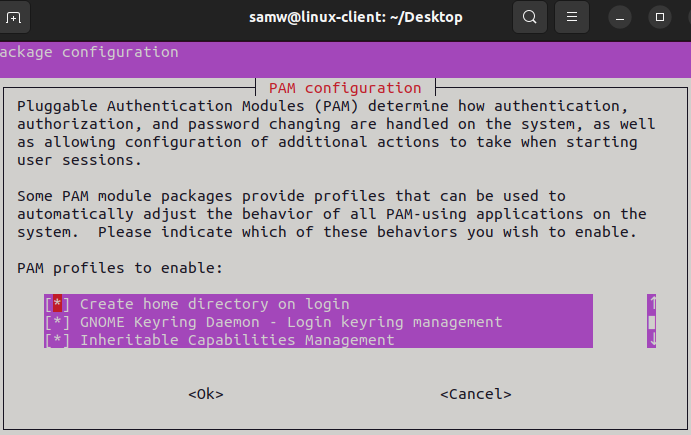

[← Back to index](../index.md){: .btn .btn-blue }

# Linux workstation (AD join)

Goal: Build an Ubuntu 22.04 Desktop workstation named `eadl-linux-client`, give it a static IP on the lab NAT network, point DNS to the domain controller, and join the domain `corp.eadl-dc.com` using Samba/Winbind. [file:55]

## Prerequisites

- Active Directory baseline is online on `eadl-dc (10.0.0.5)` with DNS and a forwarder configured. [file:55]  
- VirtualBox NAT Network `eadl-network (10.0.0.0/24, gateway 10.0.0.1)` exists and is used by all VMs. [file:55]  
- Ubuntu 22.04.5 Desktop ISO downloaded to the host. [file:55]

## 1) Create the VM (VirtualBox)

- Name: `eadl-linux-client`, `2 vCPU`, `2 GB RAM`, `25 GB` disk; attach Adapter 1 to NAT Network → Name: `eadl-network`; Adapter type: Intel PRO/1000 MT Desktop; Cable connected. [file:55]

<details>
  <summary><strong>Click to show screenshot</strong></summary>
  
</details>

## 2) Install Ubuntu 22.04 Desktop

- Proceed with the standard installer; sample unattended values used in notes: real name “Sam Wilson”, username `samw`, password `password123@` (weak on purpose for lab). [file:55]  
- After first boot, set Power → Blank screen “Never” to avoid session drops during lab work. [file:55]

<details>
  <summary><strong>Click to show screenshot</strong></summary>
  
</details>

## 3) Configure network (static IP + DNS)

- Set static IPv4 and DNS so AD lookups are reliable: `IP 10.0.0.101`, `Mask 255.255.255.0`, `Gateway 10.0.0.1`, `DNS 10.0.0.5`. [file:55]

<details>
  <summary><strong>Click to show screenshot</strong></summary>
  
</details>

## 4) Snapshot: baseline

- Take a snapshot “Baseline conf” so the workstation can be restored before domain join or agent installs. [file:55]

<details>
  <summary><strong>Click to show screenshot</strong></summary>
  
</details>

## 5) Install Samba winbind


Winbind lets the Linux workstation log in with AD users and map their groups correctly, matching how Windows clients behave in this lab.

First i did sudo apt update to refresh the list of all the repositories so the system always know the last version.
then 
    
<pre><code>sudo apt -y install winbind libpam-winbind libnss-winbind krb5-config samba-dsdb-modules samba-vfs-modules</code></pre>


winbind: AD client that talks to domain controllers and maps AD users/groups to Linux IDs.

libpam-winbind: lets domain users authenticate at the login screen/SSH via PAM.

libnss-winbind: exposes AD users/groups to Linux tools like id/getent (NSS).

krb5-config: Kerberos pieces needed for secure, ticket‑based AD authentication.

samba-dsdb-modules + samba-vfs-modules: Samba add‑ons used by domain members and SMB features.

Why Kerberos
AD uses Kerberos by default; tickets provide single sign‑on without sending passwords, and require time sync with the DC.

Winbind relies on Kerberos to join the machine account and to authenticate users to domain services


That command installs the full AD join stack on Ubuntu—Samba + Winbind + Kerberos—so the Linux workstation can join corp.eadl-dc.com and let CORP users log in with domain credentials


after those 2 command i was prompted with several screens 
kerberos configuration are three screenshot kerberos1 kerberos2 kerberos3

after the installation is completed 
i will use the command

```jsx
     sudo mv /etc/samba/smb.conf /etc/samba/smb.conf.org

```

then i will open the smb.conf file

```jsx
     sudo nano /etc/samba/smb.conf

```

THEN PASTE THOSE CODES INSIDE

```jsx
[global]
       kerberos method = secrets and keytab
       realm = PUT HERE DOMAIN CONTROLLER IN  MY CASE CORP.EADL-DC.com
       workgroup = CORP
       security = ads
       template shell = /bin/bash
       winbind enum groups = Yes
       winbind enum users = Yes
       winbind separator = +
       idmap config * : rangesize = 1000000
       idmap config * : range = 1000000-19999999
       idmap config * : backend = autorid
```

<details>
  <summary><strong>Click to show screenshot</strong></summary>
  
</details>

then save it using ctrl x and then  press y
then lets use the command


     sudo nano /etc/nsswitch.conf


lets configure it like this 


<details>
  <summary><strong>Click to show screenshot</strong></summary>
  
</details>

So on linux everytbody has interactive login, now lets install AD

lets do the command:      sudo pam-auth-update

and then lets go below with the arrow keyboard and select 

create home directory on login like in photo Use the space button to select it and click ok

<details>
  <summary><strong>Click to show screenshot</strong></summary>
  
</details>

then lets use the command


      sudo nano /etc/resolv.conf


and then lets  add the domain controller ip

and then lets use the command to restart winbind

```jsx
      **systemctl restart winbind**

```

and then lets login

```jsx
      sudo net ads join -U Administrator

```

WARNING The clock should be same, DC and workstation should have the same clock, or it doesnt sync as you can see in photo


THEN sudo net ads join -U Administrator SCREENSHOT sudoadsnet.png

<details>
  <summary><strong>Click to show screenshot</strong></summary>
  
</details>


Then later lets see the workstation created
wbinfo -u screenshot wbinfo.png

<details>
  <summary><strong>Click to show screenshot</strong></summary>
  
</details>


NOW L;ETS LOGIN AS SAM WILSON  (the course did two use Jane De And John Due i just did Sam Wilson just to make it different ) 

sudo login screnshoot sudologinsamw.png


<details>
  <summary><strong>Click to show screenshot</strong></summary>
  
</details>


put password
as you can see im logged as SAMW SCREENSHOT directorycreated.png


<details>
  <summary><strong>Click to show screenshot</strong></summary>
  
</details>
