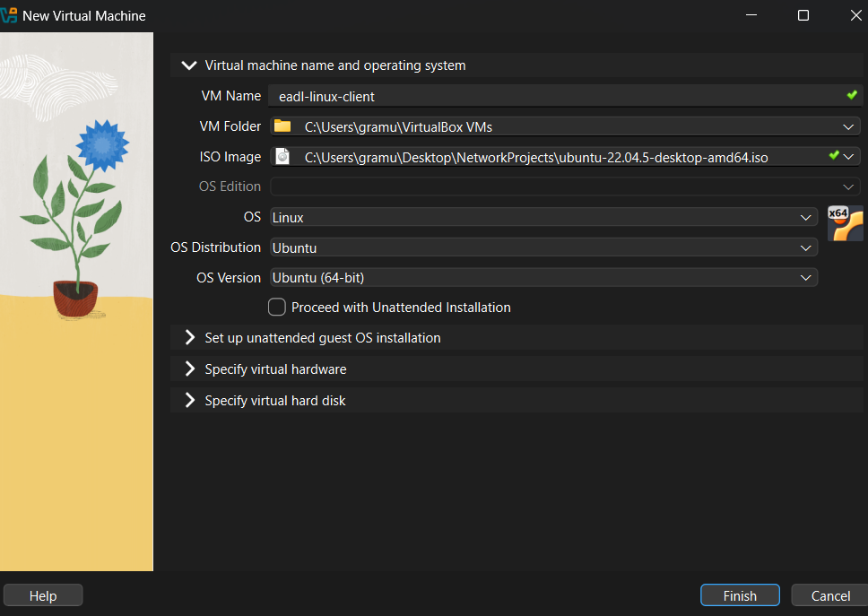
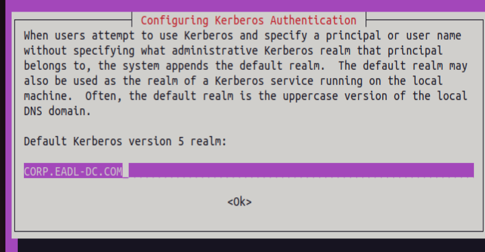
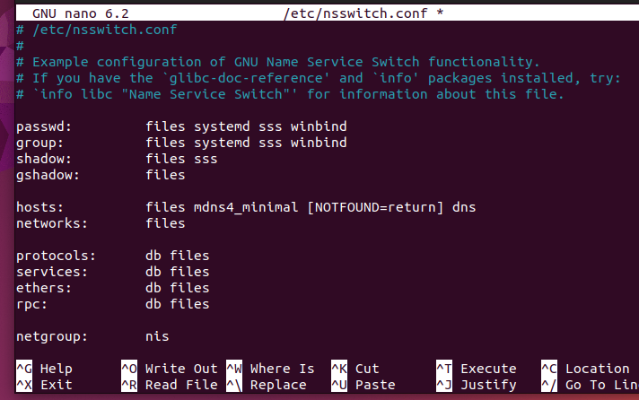
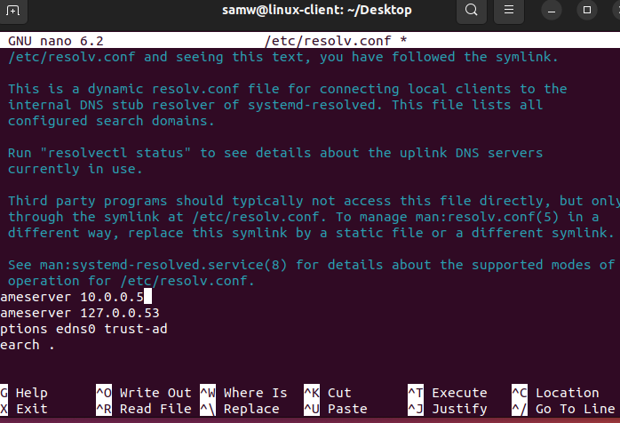
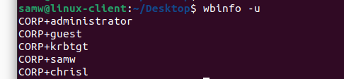
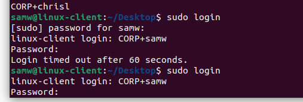

[← Back to index](../index.md){: .btn .btn-blue }

# Linux workstation (AD join)

Goal: Build an Ubuntu 22.04 Desktop workstation named `eadl-linux-client`, give it a static IP on the lab NAT network, point DNS to the domain controller, and join the domain `corp.eadl-dc.com` using Samba/Winbind. [file:55]

## Prerequisites

- Active Directory baseline is online on `eadl-dc (10.0.0.5)` with DNS and a forwarder configured. [file:55]  
- VirtualBox NAT Network `eadl-network (10.0.0.0/24, gateway 10.0.0.1)` exists and is used by all VMs. [file:55]  
- Ubuntu 22.04.5 Desktop ISO downloaded to the host. [file:55]

## 1) Create the VM (VirtualBox)

- Name: `eadl-linux-client`, `2 vCPU`, `2 GB RAM`, `25 GB` disk; attach Adapter 1 to NAT Network → Name: `eadl-network`; Adapter type: Intel PRO/1000 MT Desktop; Cable connected. [file:55]

<details>
  <summary><strong>Click to show screenshot</strong></summary>
  
</details>

## 2) Install Ubuntu 22.04 Desktop

- Proceed with the standard installer; sample unattended values used in notes: real name “Sam Wilson”, username `samw`, password `password123@` (weak on purpose for lab). [file:55]  
- After first boot, set Power → Blank screen “Never” to avoid session drops during lab work. [file:55]

<details>
  <summary><strong>Click to show screenshot</strong></summary>
  
</details>

## 3) Configure network (static IP + DNS)

- Set static IPv4 and DNS so AD lookups are reliable: `IP 10.0.0.101`, `Mask 255.255.255.0`, `Gateway 10.0.0.1`, `DNS 10.0.0.5`. [file:55]

<details>
  <summary><strong>Click to show screenshot</strong></summary>
  
</details>

## 4) Snapshot: baseline

- Take a snapshot “Baseline conf” so the workstation can be restored before domain join or agent installs. [file:55]

<details>
  <summary><strong>Click to show screenshot</strong></summary>
  
</details>

<section id="install-samba-winbind" style="border:1px solid #e5e7eb;border-radius:8px;padding:16px;background:#fff;">
  <h2 style="margin-top:0;">5) Install Samba winbind</h2>

  <!-- Context callout -->
  <div style="border-left:4px solid #2563eb;background:#f8fafc;padding:12px 14px;margin:8px 0 16px 0;">
    <p style="margin:0;">
      Winbind lets the Linux workstation log in with AD users and map their groups correctly, matching how Windows clients behave in this lab.
    </p>
  </div>

  <!-- Step 1 -->
  <h3 style="margin:18px 0 8px;">Step 1 — Update repositories</h3>
  <p style="margin:6px 0;">First i did <code>sudo apt update</code> to refresh the list of all the repositories so the system always know the last version.</p>

  <!-- Step 2 -->
  <h3 style="margin:18px 0 8px;">Step 2 — Install the AD join stack</h3>
  <pre style="background:#0b1021;color:#e5e7eb;padding:12px;border-radius:6px;overflow:auto;"><code>sudo apt -y install winbind libpam-winbind libnss-winbind krb5-config samba-dsdb-modules samba-vfs-modules</code></pre>

  <!-- Package notes as compact definition list -->
  <div style="display:grid;grid-template-columns:1fr 2fr;gap:8px;border:1px solid #eee;border-radius:6px;padding:10px;margin-top:8px;">
    <div><strong>winbind</strong></div><div>AD client that talks to domain controllers and maps AD users/groups to Linux IDs.</div>
    <div><strong>libpam-winbind</strong></div><div>lets domain users authenticate at the login screen/SSH via PAM.</div>
    <div><strong>libnss-winbind</strong></div><div>exposes AD users/groups to Linux tools like id/getent (NSS).</div>
    <div><strong>krb5-config</strong></div><div>Kerberos pieces needed for secure, ticket‑based AD authentication.</div>
    <div><strong>samba-dsdb-modules + samba-vfs-modules</strong></div><div>Samba add‑ons used by domain members and SMB features.</div>
  </div>

  <!-- Why Kerberos -->
  <details style="margin-top:14px;">
    <summary style="cursor:pointer;font-weight:600;">Why Kerberos</summary>
    <div style="border-left:4px solid #7c3aed;background:#faf5ff;padding:10px 12px;margin-top:8px;">
      <p style="margin:6px 0;">AD uses Kerberos by default; tickets provide single sign‑on without sending passwords, and require time sync with the DC.</p>
      <p style="margin:6px 0;">Winbind relies on Kerberos to join the machine account and to authenticate users to domain services.</p>
      <p style="margin:6px 0;">That command installs the full AD join stack on Ubuntu—Samba + Winbind + Kerberos—so the Linux workstation can join <code>corp.eadl-dc.com</code> and let CORP users log in with domain credentials.</p>
    </div>
  </details>
After issuing the command i was prompted with those following pages, lets configure Kerberos: Lets add <B>CORP.EADL-DC.COM</B>
  <!-- Kerberos prompts screenshots -->
  <h4 style="margin:18px 0 8px;">Kerberos configuration prompts</h4>
  <div style="display:flex;gap:10px;flex-wrap:wrap;">
    
    
    
  </div>

  <hr style="margin:18px 0;">

  <!-- smb.conf -->
  <h3 style="margin:18px 0 8px;">Step 3 — Backup and edit Samba</h3>
  smb.conf: tells Linux “join this AD domain and use these rules for users/groups.
  <pre style="background:#0b1021;color:#e5e7eb;padding:12px;border-radius:6px;overflow:auto;"><code>sudo mv /etc/samba/smb.conf /etc/samba/smb.conf.org
sudo nano /etc/samba/smb.conf</code></pre>

  <p style="margin:10px 0 6px;">Then i ll paste the following page to configure samba</p>
  <pre style="background:#0b1021;color:#e5e7eb;padding:12px;border-radius:6px;overflow:auto;"><code>[global]
       kerberos method = secrets and keytab
       realm = PUT HERE DOMAIN CONTROLLER IN  MY CASE CORP.EADL-DC.com
       workgroup = CORP
       security = ads
       template shell = /bin/bash
       winbind enum groups = Yes
       winbind enum users = Yes
       winbind separator = +
       idmap config * : rangesize = 1000000
       idmap config * : range = 1000000-19999999
       idmap config * : backend = autorid</code></pre>

  <p style="margin:6px 0;">using nano to display and modify the file as follow</p>
  

  <p style="margin:10px 0;">then save it using <kbd>ctrl</kbd> + <kbd>x</kbd> and then press <kbd>y</kbd></p>

  <!-- nsswitch -->
  <h3 style="margin:18px 0 8px;">Step 4 — Configure NSS</h3>
  <pre style="background:#0b1021;color:#e5e7eb;padding:12px;border-radius:6px;overflow:auto;"><code>sudo nano /etc/nsswitch.conf</code></pre>
  <p style="margin:6px 0;">lets configure it like this</p>
  

  <!-- PAM -->
  <p style="margin:12px 0 6px;">So on linux everytbody has interactive login, now lets install AD<br>lets do the command:</p>
  <pre style="background:#0b1021;color:#e5e7eb;padding:12px;border-radius:6px;overflow:auto;"><code>sudo pam-auth-update</code></pre>
  <p style="margin:6px 0;">and then lets go below with the arrow keyboard and select <em>create home directory on login</em> like in photo. Use the space button to select it and click ok</p>
  

  <!-- resolv.conf -->
  <h3 style="margin:18px 0 8px;">Step 5 — Point DNS to the DC</h3>
  <pre style="background:#0b1021;color:#e5e7eb;padding:12px;border-radius:6px;overflow:auto;"><code>sudo nano /etc/resolv.conf</code></pre>
  <p style="margin:6px 0;">and then lets  add the domain controller ip</p>
  

  <!-- restart/join -->
  <h3 style="margin:18px 0 8px;">Step 6 — Restart and join the domain</h3>
  <pre style="background:#0b1021;color:#e5e7eb;padding:12px;border-radius:6px;overflow:auto;"><code>systemctl restart winbind
sudo net ads join -U Administrator</code></pre>

  <!-- Warning callout -->
  <div style="border-left:4px solid #f59e0b;background:#fffbeb;padding:10px 12px;margin:10px 0;">
    <strong>WARNING</strong> The clock should be same, DC and workstation should have the same clock, or it doesnt sync as you can see in photo.
  </div>

  

  <!-- Verify -->
  <h3 style="margin:18px 0 8px;">Step 7 — Verify</h3>
  <p style="margin:6px 0;">Then later lets see the workstation created</p>
  

  <!-- First domain login -->
  <h3 style="margin:18px 0 8px;">Step 8 — First domain login</h3>
  <p style="margin:6px 0;">NOW L;ETS LOGIN AS SAM WILSON  (the course did two use Jane De And John Due i just did Sam Wilson just to make it different )</p>
  

  <p style="margin:6px 0;">put password<br>as you can see im logged as SAMW</p>
  
</section>


after those 2 command i was prompted with several screens 
kerberos configuration are three screenshot kerberos1 kerberos2 kerberos3

after the installation is completed 
i will use the command

```jsx
     sudo mv /etc/samba/smb.conf /etc/samba/smb.conf.org

```

then i will open the smb.conf file

```jsx
     sudo nano /etc/samba/smb.conf

```

THEN PASTE THOSE CODES INSIDE

```jsx
[global]
       kerberos method = secrets and keytab
       realm = PUT HERE DOMAIN CONTROLLER IN  MY CASE CORP.EADL-DC.com
       workgroup = CORP
       security = ads
       template shell = /bin/bash
       winbind enum groups = Yes
       winbind enum users = Yes
       winbind separator = +
       idmap config * : rangesize = 1000000
       idmap config * : range = 1000000-19999999
       idmap config * : backend = autorid
```

<details>
  <summary><strong>Click to show screenshot</strong></summary>
  
</details>

then save it using ctrl x and then  press y
then lets use the command


     sudo nano /etc/nsswitch.conf


lets configure it like this 


<details>
  <summary><strong>Click to show screenshot</strong></summary>
  
</details>

So on linux everytbody has interactive login, now lets install AD

lets do the command:      sudo pam-auth-update

and then lets go below with the arrow keyboard and select 

create home directory on login like in photo Use the space button to select it and click ok

<details>
  <summary><strong>Click to show screenshot</strong></summary>
  
</details>

then lets use the command


      sudo nano /etc/resolv.conf


and then lets  add the domain controller ip

and then lets use the command to restart winbind

```jsx
      **systemctl restart winbind**

```

and then lets login

```jsx
      sudo net ads join -U Administrator

```

WARNING The clock should be same, DC and workstation should have the same clock, or it doesnt sync as you can see in photo


THEN sudo net ads join -U Administrator SCREENSHOT sudoadsnet.png

<details>
  <summary><strong>Click to show screenshot</strong></summary>
  
</details>


Then later lets see the workstation created
wbinfo -u screenshot wbinfo.png

<details>
  <summary><strong>Click to show screenshot</strong></summary>
  
</details>


NOW L;ETS LOGIN AS SAM WILSON  (the course did two use Jane De And John Due i just did Sam Wilson just to make it different ) 

sudo login screnshoot sudologinsamw.png


<details>
  <summary><strong>Click to show screenshot</strong></summary>
  
</details>


put password
as you can see im logged as SAMW SCREENSHOT directorycreated.png


<details>
  <summary><strong>Click to show screenshot</strong></summary>
  
</details>
