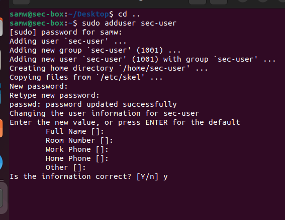
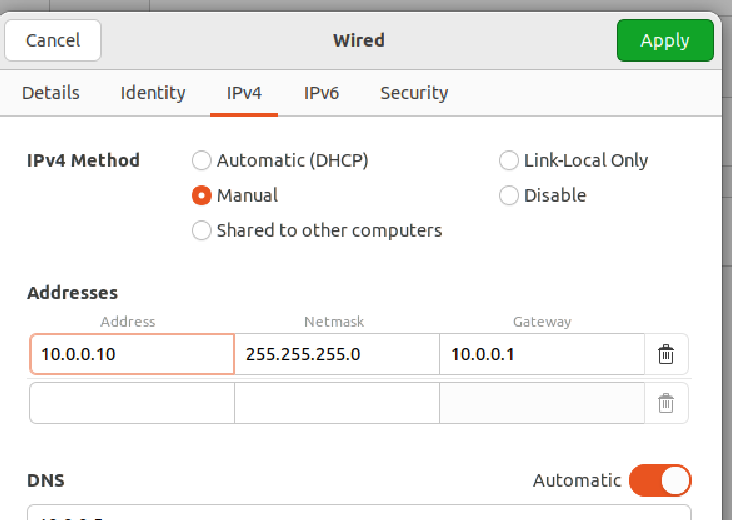
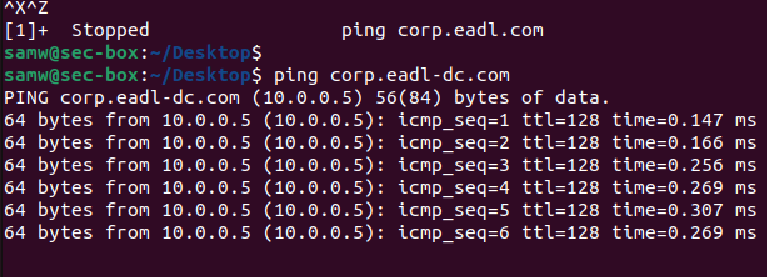
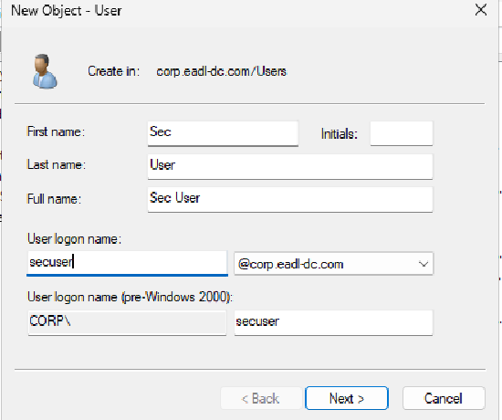
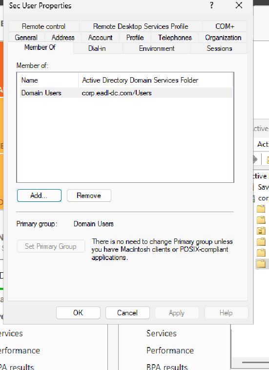
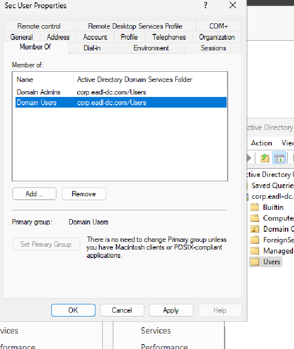
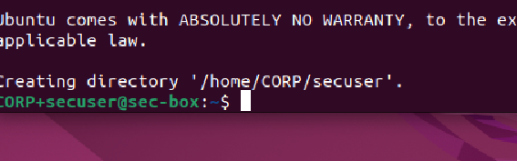
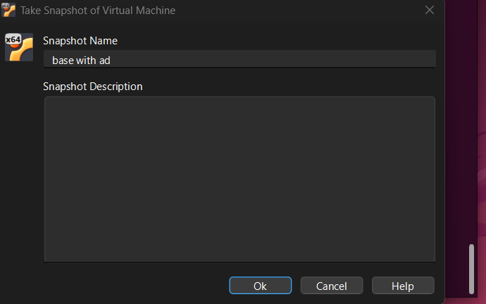

[← Back to index](../index.md){: .btn .btn-blue }

# Security server (sec-box) prep

<!-- Intro callout -->

  

    
🛡️

    

      
Goal

      

        Clone the Linux workstation into <code>sec-box</code>, create a local admin, set a static IP, join the AD domain,
        verify Winbind, and snapshot the VM before installing Wazuh.
      

    

  

## 1) Clone the Linux machine

- VirtualBox → select Linux workstation → Right‑click → Clone → Full clone → include snapshots → Finish.  
- Power on the clone.

## 2) Rename hostname

<pre style="background:#0b1021;color:#e5e7eb;padding:12px;border-radius:6px;overflow:auto;"><code>sudo nano /etc/hostname</code></pre>

Replace contents with:

<pre style="background:#0b1021;color:#e5e7eb;padding:12px;border-radius:6px;overflow:auto;"><code>sec-box</code></pre>

Then reboot:

<pre style="background:#0b1021;color:#e5e7eb;padding:12px;border-radius:6px;overflow:auto;"><code>sudo reboot</code></pre>

## 3) Create local admin and grant sudo

<pre style="background:#0b1021;color:#e5e7eb;padding:12px;border-radius:6px;overflow:auto;"><code>cd ..
sudo adduser sec-user</code></pre>

Grant and test:

<pre style="background:#0b1021;color:#e5e7eb;padding:12px;border-radius:6px;overflow:auto;"><code>sudo usermod -aG sudo sec-user
sudo su - sec-user
whoami</code></pre>

## 4) Network settings (static IP)

- Top bar → Wired connected → Wired Settings → gear icon → IPv4 → Manual → apply settings as shown.

Test DC reachability:

<pre style="background:#0b1021;color:#e5e7eb;padding:12px;border-radius:6px;overflow:auto;"><code>ping -c 3 eadl-dc</code></pre>

## 5) Create the domain user (on DC)

- DC → Tools → Active Directory Users and Computers → Users → Right‑click → New → User → finish wizard.

- Right‑click user → Properties → Member Of → confirm Domain Users.

Optional group management:

  
  

## 6) Join sec-box to the domain

Ensure DNS points to the DC and the clock is in sync.

<pre style="background:#0b1021;color:#e5e7eb;padding:12px;border-radius:6px;overflow:auto;"><code>sudo systemctl restart winbind
sudo net ads join -U Administrator
sudo systemctl restart winbind</code></pre>

Verify:

<pre style="background:#0b1021;color:#e5e7eb;padding:12px;border-radius:6px;overflow:auto;"><code>wbinfo -u | head</code></pre>

Login test (create home):

<pre style="background:#0b1021;color:#e5e7eb;padding:12px;border-radius:6px;overflow:auto;"><code>sudo login</code></pre>

## 7) Snapshot before Wazuh

- Create snapshot “pre‑wazuh”.

