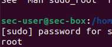

<!DOCTYPE html>
<html lang="en">
<head>
<meta charset="utf-8">
<title>06 — Security server (sec-box) prep</title>
<meta name="viewport" content="width=device-width, initial-scale=1">

</head>
<body>

<a class="btn" href="../index.md">← Back to index</a>

<h1>Security server (sec-box) prep</h1>

  Clone the Linux workstation into <b>sec-box</b>, create a local admin, set a static IP, join the AD domain, verify Winbind, and snapshot the VM before installing Wazuh. Screenshots: <code>/assets/images/06-security-server-sec-box</code>.

<h2>1) Clone the Linux machine</h2>
<ul>
  <li>VirtualBox → select Linux workstation → Right‑click → Clone → <b>Full clone</b> → include snapshots → Finish.</li>
  <li>Power on the clone.</li>
</ul>

<h2>2) Rename hostname</h2>
<pre><code>sudo nano /etc/hostname</code></pre>

Replace with:

<pre><code>sec-box</code></pre>

Then reboot:

<pre><code>sudo reboot</code></pre>

<h2>3) Create local admin and grant sudo</h2>
<pre><code>cd ..
sudo adduser sec-user</code></pre>

<pre><code>sudo usermod -aG sudo sec-user
sudo su - sec-user
whoami</code></pre>

<h2>4) Network settings (static IP)</h2>

Top bar → Wired connected → Wired Settings → gear icon → IPv4 → Manual → configure as in the screenshot.

<pre><code>ping -c 3 eadl-dc</code></pre>

<h2>5) Create the domain user (on DC)</h2>
<ul>
  <li>DC → Tools → Active Directory Users and Computers → Users → Right‑click → New → User → finish wizard.</li>
</ul>

Open the user → <b>Member Of</b> → verify <b>Domain Users</b>.

(Optional) Create an admin group and assign members.

  
  

<h2>6) Join sec-box to the domain</h2>

Ensure DNS points to the DC and the clock is in sync.

<pre><code>sudo systemctl restart winbind
sudo net ads join -U Administrator
sudo systemctl restart winbind</code></pre>

<pre><code>wbinfo -u | head</code></pre>

<h2>7) First domain login (home created)</h2>
<pre><code>sudo login</code></pre>

After first domain login a home directory is created automatically.

<h2>8) Snapshot before Wazuh</h2>

Create a VM snapshot named <b>pre‑wazuh</b> in VirtualBox.

</body>
</html>
