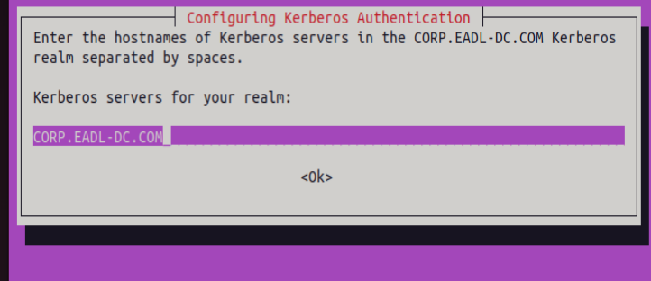

[← Back to index](../index.md){: .btn .btn-blue }

# Linux workstation (AD join)

<!-- Intro callout -->

  

    
🎯

    

      
Goal

      

        Build an Ubuntu 22.04 Desktop workstation named
        <code>eadl-linux-client</code>, give it a static IP on the lab NAT
        network, point DNS to the domain controller, and join the domain
        <code>corp.eadl-dc.com</code> using Samba/Winbind.
      

    

  

## Prerequisites

- Active Directory baseline is online on `eadl-dc (10.0.0.5)` with DNS and a forwarder configured.  
- VirtualBox NAT Network `eadl-network (10.0.0.0/24, gateway 10.0.0.1)` exists and is used by all VMs.  
- Ubuntu 22.04.5 Desktop ISO downloaded to the host.

## 1) Create the VM (VirtualBox)

- Name: `eadl-linux-client`, `2 vCPU`, `2 GB RAM`, `25 GB` disk; attach Adapter 1 to NAT Network → Name: `eadl-network`; Adapter type: Intel PRO/1000 MT Desktop; Cable connected.

  
<strong>Click to show screenshot</strong>

  

## 2) Install Ubuntu 22.04 Desktop

- Proceed with the standard installer; sample unattended values used in notes: real name “Sam Wilson”, username `samw`, password `password123@` (weak on purpose for lab).  
- After first boot, set Power → Blank screen “Never” to avoid session drops during lab work.

  
<strong>Click to show screenshot</strong>

  

## 3) Configure network (static IP + DNS)

- Set static IPv4 and DNS so AD lookups are reliable: `IP 10.0.0.101`, `Mask 255.255.255.0`, `Gateway 10.0.0.1`, `DNS 10.0.0.5`.

  
<strong>Click to show screenshot</strong>

  

## 4) Snapshot: baseline

- Take a snapshot “Baseline conf” so the workstation can be restored before domain join or agent installs.

  
<strong>Click to show screenshot</strong>

  

<section id="install-samba-winbind" style="border:1px solid #e5e7eb;border-radius:8px;padding:16px;background:#fff;">
  <h2 style="margin-top:0;">5) Install Samba winbind</h2>

  <!-- Context callout -->
  

    

      Winbind lets the Linux workstation log in with AD users and map their groups correctly, matching how Windows clients behave in this lab.
    

  

  <!-- Step 1 -->
  <h3 style="margin:18px 0 8px;">Step 1 — Update repositories</h3>
  
First i did <code>sudo apt update</code> to refresh the list of all the repositories so the system always know the last version.

  <!-- Step 2 -->
  <h3 style="margin:18px 0 8px;">Step 2 — Install the AD join stack</h3>
  <pre style="background:#0b1021;color:#e5e7eb;padding:12px;border-radius:6px;overflow:auto;"><code>sudo apt -y install winbind libpam-winbind libnss-winbind krb5-config samba-dsdb-modules samba-vfs-modules</code></pre>

  <!-- Package notes as compact definition list -->
  

    
<strong>winbind</strong>

AD client that talks to domain controllers and maps AD users/groups to Linux IDs.

    
<strong>libpam-winbind</strong>

lets domain users authenticate at the login screen/SSH via PAM.

    
<strong>libnss-winbind</strong>

exposes AD users/groups to Linux tools like id/getent (NSS).

    
<strong>krb5-config</strong>

Kerberos pieces needed for secure, ticket‑based AD authentication.

    
<strong>samba-dsdb-modules + samba-vfs-modules</strong>

Samba add‑ons used by domain members and SMB features.

  

  <!-- Why Kerberos -->
  

    
Why Kerberos

    

      
AD uses Kerberos by default; tickets provide single sign‑on without sending passwords, and require time sync with the DC.

      
Winbind relies on Kerberos to join the machine account and to authenticate users to domain services.

      
That command installs the full AD join stack on Ubuntu—Samba + Winbind + Kerberos—so the Linux workstation can join <code>corp.eadl-dc.com</code> and let CORP users log in with domain credentials.

    

  

  
After issuing the command i was prompted with those following pages, lets configure Kerberos: Lets add <b>CORP.EADL-DC.COM</b>

  <!-- Kerberos prompts screenshots -->
  <h4 style="margin:18px 0 8px;">Kerberos configuration prompts</h4>
  

    
    
    
  

  

  <!-- smb.conf -->
  <h3 style="margin:18px 0 8px;">Step 3 — Backup and edit Samba</h3>
  
smb.conf: tells Linux “join this AD domain and use these rules for users/groups.”

  <pre style="background:#0b1021;color:#e5e7eb;padding:12px;border-radius:6px;overflow:auto;"><code>sudo mv /etc/samba/smb.conf /etc/samba/smb.conf.org
sudo nano /etc/samba/smb.conf</code></pre>

  
Then i ll paste the following page to configure samba

  <pre style="background:#0b1021;color:#e5e7eb;padding:12px;border-radius:6px;overflow:auto;"><code>[global]
       kerberos method = secrets and keytab
       realm = PUT HERE DOMAIN CONTROLLER IN  MY CASE CORP.EADL-DC.com
       workgroup = CORP
       security = ads
       template shell = /bin/bash
       winbind enum groups = Yes
       winbind enum users = Yes
       winbind separator = +
       idmap config * : rangesize = 1000000
       idmap config * : range = 1000000-19999999
       idmap config * : backend = autorid</code></pre>

  
using nano to display and modify the file as follow

  

  
then save it using <kbd>ctrl</kbd> + <kbd>x</kbd> and then press <kbd>y</kbd>

  <!-- nsswitch -->
  <h3 style="margin:18px 0 8px;">Step 4 — Configure NSS</h3>
  <pre style="background:#0b1021;color:#e5e7eb;padding:12px;border-radius:6px;overflow:auto;"><code>sudo nano /etc/nsswitch.conf</code></pre>
  
lets configure it like this

  

  <!-- PAM -->
  
So on linux everytbody has interactive login, now lets install AD lets do the command:

  <pre style="background:#0b1021;color:#e5e7eb;padding:12px;border-radius:6px;overflow:auto;"><code>sudo pam-auth-update</code></pre>
  
and then lets go below with the arrow keyboard and select <em>create home directory on login</em> like in photo. Use the space button to select it and click ok

  

  <!-- resolv.conf -->
  <h3 style="margin:18px 0 8px;">Step 5 — Point DNS to the DC</h3>
  <pre style="background:#0b1021;color:#e5e7eb;padding:12px;border-radius:6px;overflow:auto;"><code>sudo nano /etc/resolv.conf</code></pre>
  
and then lets  add the domain controller ip

  

  <!-- restart/join -->
  <h3 style="margin:18px 0 8px;">Step 6 — Restart and join the domain</h3>
  <pre style="background:#0b1021;color:#e5e7eb;padding:12px;border-radius:6px;overflow:auto;"><code>systemctl restart winbind
sudo net ads join -U Administrator</code></pre>

  <!-- Warning callout -->
  

    <strong>WARNING</strong> The clock should be same, DC and workstation should have the same clock, or it doesnt sync as you can see in photo.
  

  

  <!-- Verify -->
  <h3 style="margin:18px 0 8px;">Step 7 — Verify</h3>
  
Then later lets see the workstation created

  

  <!-- First domain login -->
  <h3 style="margin:18px 0 8px;">Step 8 — First domain login</h3>
  
NOW L;ETS LOGIN AS SAM WILSON  (the course did two use Jane De And John Due i just did Sam Wilson just to make it different )

  

  
put password as you can see im logged as SAMW

  
</section>

then after 

 <!-- First domain login -->
  <h3 style="margin:18px 0 8px;">Step 9 — Check on Domain Controller</h3>
  
Now lets check on domain controller if Linux Workstation is inside theDC

  

  
put password as you can see its inside

  
</section>
